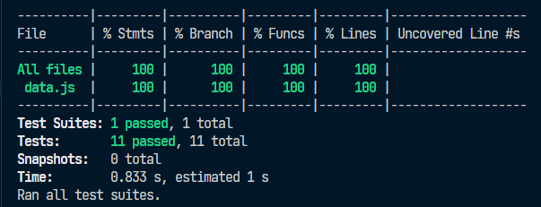

# Data Lovers - Breaking Bad

# Data Lovers - Breaking Bad

  Access the project [here](https://geanemr.github.io/SAP010-data-lovers/)  
   
  Project status: Completed ✔ 
  Technologies used:  

  <a href="https://developer.mozilla.org/en-US/docs/Learn/Getting_started_with_the_web/HTML_basics">
  
  <a href="https://developer.mozilla.org/en-US/docs/Web/CSS">
  
  <a href="https://developer.mozilla.org/en-US/docs/Learn/JavaScript/First_steps/What_is_JavaScript">
  
  <a href="https://git-scm.com/">
  
  <a href="https://github.com/">
  
  <a href="https://jestjs.io/">
  
  <a href="https://figma.com/">
  
   <a href="https://nodejs.org/en">
  
  

  

## Index

- [1. Project Summary](#1-project-summary)
- [2. User Stories](#2-user-stories)
- [3. User Interface Design](#3-user-interface-design)
- [4. Usability Testing](#4-usability-testing)
- [5. Unit Tests](#5-unit-tests)
- [6. Achieved Objectives](#6-achieved-objectives)
- [7. Developers](#7-developers)

---

## 1. Project Summary

Developed during the [Laboratória](https://www.laboratoria.la/br) bootcamp, the Data Lovers project aimed to build a web page that allows users to view, filter, sort, and perform aggregated calculations on data based on their needs.

The chosen theme was Breaking Bad, and the site is designed for fans of the series. Users can search for their favorite characters using available filters.

## 2. User Stories

**User Story 1:**
_"As a fan of the series, I would like to know which characters appear in Breaking Bad and which appear in Better Call Saul."_

To address this user need, a filter by series was created, allowing users to select characters based on the series they appear in.

**User Story 2:**
_"As a fan of the series, I would like to remember which characters are still alive and which are not."_

To meet this request, a status filter was implemented, showing which characters are alive, deceased, or presumed dead.

## 3. User Interface Design

The site's prototype was initially drawn by hand and later created in Figma. Some adjustments were made during development to improve the user experience. For example, the filters were adjusted to allow users to navigate between them more easily:

#### Low-Fidelity Prototype

The "nickname," "occupation," and "status" filters were replaced by "status" and "series." The last two cover a larger number of characters, enabling broader searches. Additionally, the series filter allows users to see which series a character appears in. Below are the Figma prototypes:

#### High-Fidelity Desktop Prototype

#### High-Fidelity Mobile Prototype

## 4. Usability Testing

Usability testing was conducted to evaluate user interaction with the interface and to improve the design based on feedback.

### Identified Issues and Solutions:

**Issue 1:**  
The "clear" button looked similar to other buttons, potentially confusing users who might mistake it for a filter button.  
**Solution:**  
The button's format was maintained, but it was moved below all the filter buttons.

**Issue 2:**  
The "back" button could be clearer and have an arrow icon.  
**Solution:**  
An arrow was added, and the label was changed to "Previous."

**Issue 3:**  
The search bar should specify that the search is based on the character's name, not their nickname.  
**Solution:**  
The placeholder text was changed to "Search for name."

**Issue 4:**  
The visual transition between the header and the cards looked off. A different shade of black or extending the background might improve the appearance.  
**Solution:**  
The header background was removed, and the background image was applied to the entire body.

These solutions have been implemented in the current version of the site.

## 5. Unit Tests

As defined in the project requirements, unit tests needed to cover at least 70% of statements, functions, lines, and branches of the `src/data.js` file, which contains the functions. Our project achieved 100% test coverage.

All tests were written by our team.

## 6. Achieved Objectives

- [x] Use VanillaJS.
- [x] Pass linting (`npm run pretest`).
- [x] Pass unit tests (`npm test`).
- [x] Ensure unit tests cover at least 70% of statements, functions, lines, and branches.
- [x] Include a clear and informative _product definition_ in `README.md`.
- [x] Include user stories in `README.md`.
- [x] Include a rough solution sketch (low-fidelity prototype) in `README.md`.
- [x] Include a list of usability testing issues in `README.md`.
- [x] UI: Display a list/table/etc. with data and/or indicators.
- [x] UI: Allow sorting data by one or more fields (ascending and descending).
- [x] UI: Enable filtering data based on a condition.
- [x] UI: Be _responsive_.

## 7. Developers

Geane Ramos

 

Marina Braz

 